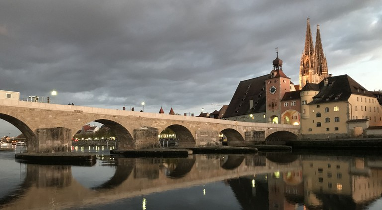
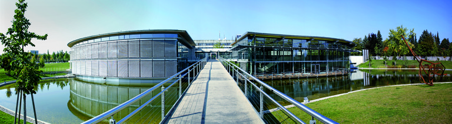

The 13th International Modelica Conference has been held at OTH Regensburg, Germany, March 4–6, 2019. It is organized by [OTH Regensburg / Faculty of Electrical Engineering and Information Technology](https://www.oth-regensburg.de/en/faculties/electrical-engineering-and-information-technology.html), in cooperation with the [Modelica Association](https://modelica.org).

# About the Conference

The Modelica Conference is the main event for users, library developers, tool vendors and language designers to share their knowledge and learn about the latest scientific and industrial progress related to [Modelica](https://modelica.org/) and to the [Functional Mockup Interface](https://fmi-standard.org/). The program will cover modeling of complex physical and cyber-physical systems, as well as tools, for a wide range of research and industrial applications.

In addition to paper presentations and poster sessions, the conference features several Modelica tutorials for beginners and advanced users, as well as industrial user presentations, vendor sessions, and an exhibition. The previous Modelica conference in 2017 in Prague, Czech Republic, was attended by more than 400 participants from all over the world, and we would like to welcome even more participants to this conference.

More information is contained in the conference [flyer](files/Modelica_Flyer_A4_online.pdf) [(print)](files/Modelica_Flyer_A4_print.pdf)/[poster](files/Modelica_Poster_online.pdf) [(print)](files/Modelica_Poster_print.pdf). The first page is intended to be printed in larger format such as A3 as a poster. Please post at your bulletin board or by the coffee machine to promote and remind about the conference.

We are looking forward to seeing you in Regensburg.

# Conference Program

The conference program, book of abstracts and other information are available here:

* Proceedings [(intro)](proceedings/html/index.html) [(LiU E-Press)](http://www.ep.liu.se/ecp/contents.asp?issue=157) [(zip)](https://github.com/modelica/ModelicaConference2019/releases/download/USB/Modelica2019Proceedings.zip)
* [Book of Abstracts](proceedings/html/Modelica2019BookOfAbstracts.pdf)
* [Conference Program](proceedings/html/Modelica2019Program.pdf)
* [Sponsors and Exhibitors](proceedings/html/exhibitors.md)
* [Library Award Winners](award.md)
* [Conference App](app.md)
* [Photos](https://www.haumer.at/oth/Modelica2019/)

# Conference Venue

The conference will take place at Ostbayerische Technische Hochschule (Eastbavarian Technical University) Regensburg near the center of Regensburg, only 30 minutes to walk from the historical centre of Regensburg.

**Venue Address**

[OTH Regensburg](https://www.oth-regensburg.de/en.html) 
Seybothstr. 2 
93053 Regensburg 
Germany

# Scope of the Conference

[Modelica](https://modelica.org/) is a freely available, equation-based, object-oriented language for convenient and efficient modeling of complex, multidomain cyber-physical systems described by ordinary differential, difference and algebraic equations.  The Modelica language and the companion Modelica Standard Library have been utilized in demanding industrial applications, including full vehicle dynamics, power systems, robotics, hardware-in-the-loop simulations and embedded control systems. The [Functional Mockup Interface (FMI)](https://fmi-standard.org/) is an open standard for the tool-independent exchange of models and for co-simulation. It is supported by many Modelica and non-Modelica tools and is the key to utilizing Modelica models in non-Modelica environments.

Development in the Modelica Association is organized in Modelica Association Projects:

* LANG - Modelica Language
* LIB - Modelica Libraries
* [FMI](https://fmi-standard.org) - Functional Mockup Interface
* [SSP](https://ssp-standard.org) - System Structure and Parameterization of Components for Virtual System Design
* [DCP](https://dcp-standard.org) - Distributed Co-Simulation Protocol

The projects collaborate to design and maintan a set of coordinated standards for modeling and simulation of complex physical systems.

The Modelica conference will bring together people using Modelica and/or other Modelica Association standards modeling, simulation, and control applications, Modelica language designers, tool vendors and library developers. The Modelica Conference provides Modelica users the opportunity to stay informed about the latest language, library, and tool developments, and to get in touch with people working on similar modeling problems. The conference will cover topics such as the following:

* Multi-engineering modeling and simulation with free and commercial Modelica libraries (mechanics, electrical, hydraulics, thermal, fluid, media, chemical, building, automotive, aircraft, ...)
* Automotive applications
* Thermodynamic and energy systems applications
* Mechatronics and robotics applications
* Medicine and biology applications
* Other industrial applications, such as electric drives, power systems, aerospace, etc.
* Large-scale system modelling
* Real-time and hardware-in-the-loop simulation
* Simulation and code generation for embedded control systems
* Simulation acceleration by use of many CPU cores or GPU cores
* Applications of Modelica for optimization and optimal control
* Modelica modeling, simulation and design tools
* Symbolic algorithms and numerical methods for model transformation and simulation
* Discrete modeling techniques − FEM, CFD, DEM (Discrete Element Method), ...
* New features of the Modelica language and of FMI
* Experimental language designs and implementations related to Modelica
* Modelica in other application areas (mathematical programming, databases etc.)
* Modelica for teaching and education
* FMI in Modelica and non-Modelica applications and tools

# Registration

Registration | Valid | incl.Dinner | Early | Late
--- | --- | --- | --- | ---
Standard | Mon-Wed | yes | €600 | €750
PhD | Mon-Wed | no | €400 | €500
Student | Mon-Wed | no | €200 | €250
Industrial User Presentations | Only Monday | no | €200 | €250
Additional Dinner Ticket | Dinner | --- | €70 | €70

Please note:

* Standard, PhD and Student Tickets are valid for all 3 days.
* Industrial User Presentations Ticket is valid only for Monday, no access to the rest of the conference.
* Choosing PhD or Student, you have to prove your status at the registration desk;
Dinner ticket is not inlcuded, you may buy an additional Dinner Ticket during the registration process.

Registration is handled by the [EasyChair Conference Management System](https://www.easychair.org/conferences/?conf=modelica2019).
You have to login to your account at EasyChair, and choose "Registration".

Late registration at the Conference Desk (payment cash or credit card) is possible!

# Special Journal Issue

It is planned that the best scored 10% of the reviewed papers are invited to be submitted in an improved and extended form for a special issue of an open access, ISI-referenced journal.

# Organization and Contact

The conference is organized by [Ostbayerische Technische Hochschule](https://www.oth-regensburg.de/en.html) (Eastbavarian Technical University of Applied Sciences) Regensburg, Faculty of Electrical Engineering and Information Technology in cooperation with the [Modelica Association](https://modelica.org).

## Conference Board

* Prof. Anton Haumer, OTH Regensburg (Conference Chair)
* Prof. Francesco Casella, Politecnico di Milano, Italy
* Dr. Hilding Elmqvist, Mogram, Lund, Sweden
* Prof. Peter Fritzson, Linköping University, Sweden
* Prof. Martin Otter, DLR, Germany
* Dr. Michael Tiller, Xogeny, Michigan, USA

## Local Organization
* Prof. Anton Haumer, OTH Regensburg, Germany
* Sandra Schäffer, M.A, OTH Regensburg, Germany
* Verena Hämmerle, M.A., OTH Regensburg, Germany
* Lara Helmig, DONAUEVENTS, Wenzenbach, Germany
* Leonie Dentel, DONAUEVENTS, Wenzenbach, Germany
