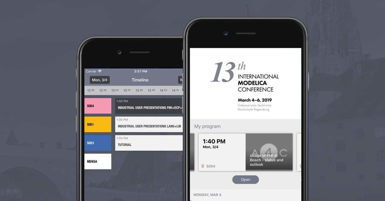

# MobileApp

The 13th International Modelica Conference takes place March 4th - 6th, 2019 at Ostbayerische Technische Hochschule (University of Applied Sciences) Regensburg, Germany.

**We provide a Conference app for free!**

This app provides access to a timeline of all sessions, an index of sessions and authors and venue maps.
Additionally, with an internet connection, you can view the one-page abstracts as well as the full papers as pdf.
Of course, at the conference site, we provide a conference wireless lan!

You can get the app for [Android](https://play.google.com/store/apps/details?id=cz.ackee.a4e.modelica) or [iOS](https://itunes.apple.com/us/app/modelica-2019/id1453498871?l=cs&ls=1&mt=8)

We have included a questionnaire - please answer a few questions, you'll help us to improve the conference!

The app is designed by [ackee](https://www.ackee.de).
