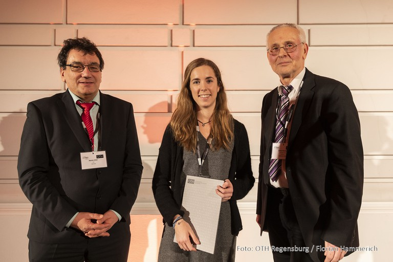
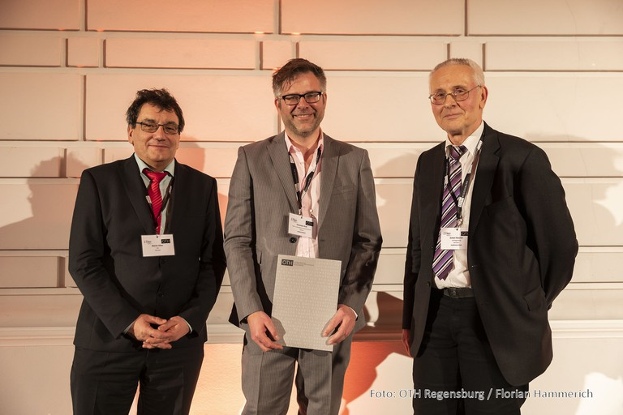

# Library Award

**Library Award at the 13th Internation Modelica Conference March 4-6, 2019, at OTH Regensburg**

At the 13th International Modelica Conference March 4-6, 2019, at OTH Regensburg two Libraries have been awarded:

First Prize:

Authors | Queralt Altes-Buch, Sylvain Quoilin, Vincent Lemort
--- | ---
Title | **Greenhouses**: A Modelica Library for the Simulation of Greenhouse Climate and Energy Systems
Files | [Abstract](proceedings/html/abstracts/Modelica2019abstract5A2.pdf) [Full paper](proceedings/html/papers/Modelica2019paper5A2.pdf)   [Attachment](proceedings/html/attachments/Modelica2019attachment095.zip)

Martin Otter (Chairman of MA), Queralt Altes-Buch, Anton Haumer (Conference Chair) 
Photo: OTH Regensburg / Florian Hammerich

Second Prize:

Authors | Jovan Brkic, Muaz Ceran, Mohamed Elmoghazy, Christian Kral
--- | ---
Title | Open Source **PhotoVoltaics** Library for Systemic Investigations
Files | [Abstract](proceedings/html/abstracts/Modelica2019abstract1B1.pdf) [Full paper](proceedings/html/papers/Modelica2019paper1B1.pdf)   [Attachment](proceedings/html/attachments/Modelica2019attachment001.zip)

Martin Otter (Chairman of MA), Christian Kral, Anton Haumer (Conference Chair) 
Photo: OTH Regensburg / Florian Hammerich

**We encourage you to submit your work for the Library Award at the next Modelica Conference!**

