<h2>Platin Sponsors &amp; Exhibitors</h2>
<table>
<tr>
  <td> &nbsp;&nbsp;<a href="https://www.altair.de/">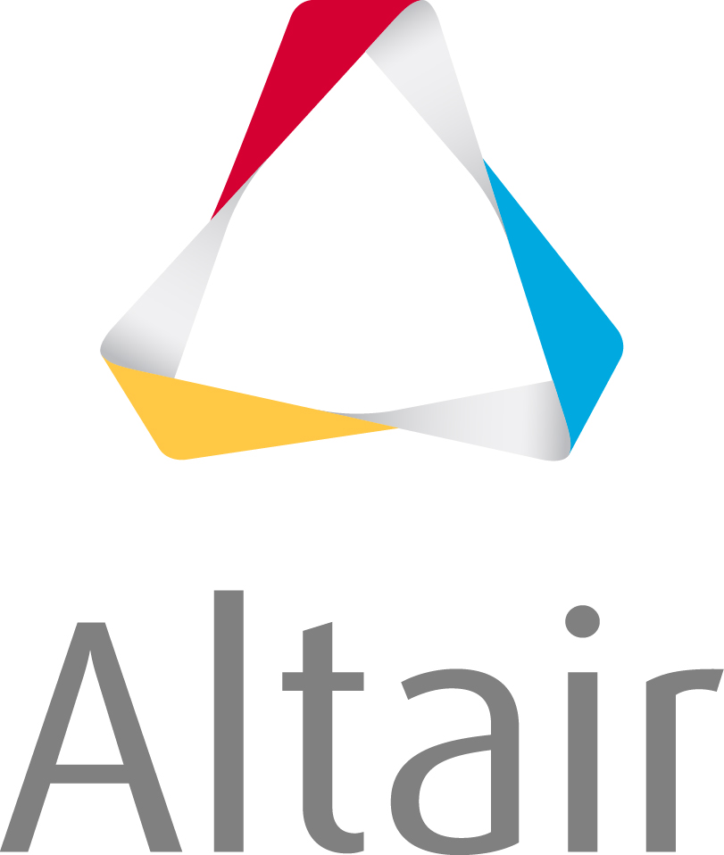</a>&nbsp;&nbsp;</td>
  <td> &nbsp;&nbsp;<a href="https://www.3ds.com/">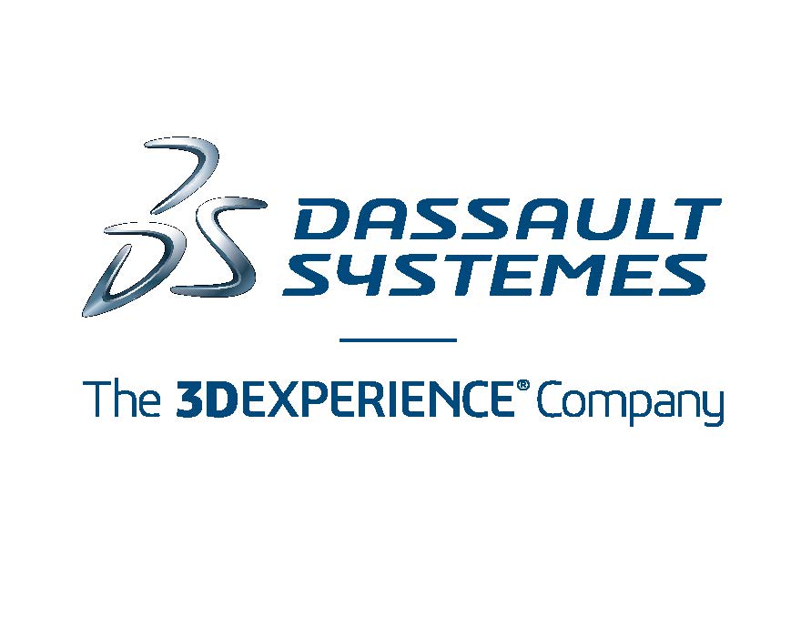</a>&nbsp;&nbsp; </td>
  <td> &nbsp;&nbsp;&nbsp;&nbsp; </td>
</tr>
</table>

<h2>Gold Sponsors &amp; Exhibitors</h2>
<table>
<tr>
  <td> &nbsp;&nbsp;<a href="https://www.gaio.com/">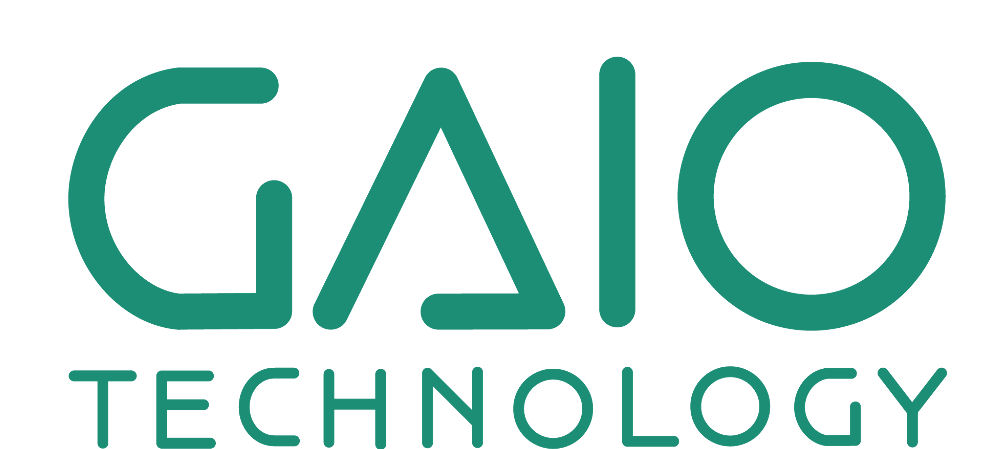</a>&nbsp;&nbsp; </td>
  <td> &nbsp;&nbsp;<a href="https://www.plm.automation.siemens.com/global/de/products/simcenter/simcenter-amesim.html">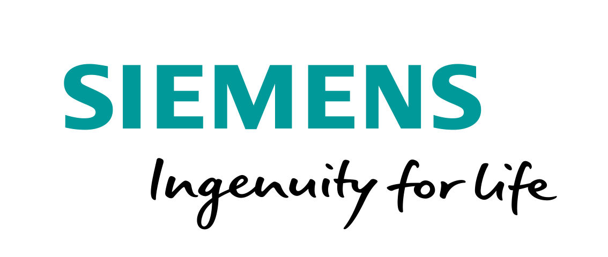</a>&nbsp;&nbsp; </td>
</tr>
</table>

<h2>Silver Sponsors &amp; Exhibitors</h2>
<table>
<tr>
  <td> &nbsp;&nbsp;<a href="https://www.claytex.com/">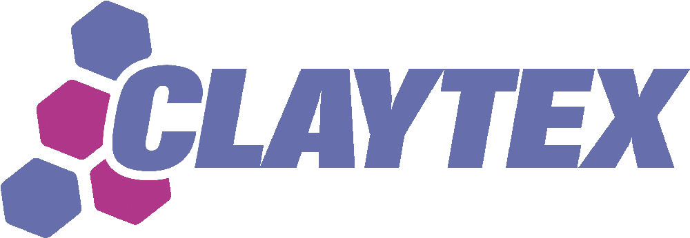</a>&nbsp;&nbsp; </td>
  <td> &nbsp;&nbsp;<a href="https://www.concurrent-rt.com/">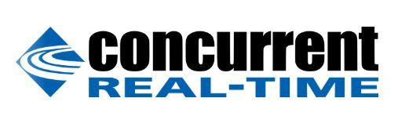</a>&nbsp;&nbsp; </td>
  <td> </td>
</tr>
<tr>
  <td> &nbsp;&nbsp;&nbsp;&nbsp; </td>
  <td> &nbsp;&nbsp;<a href="https://maplesoft.com/">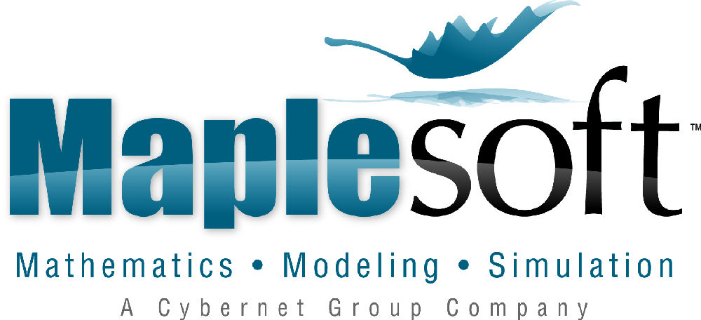</a>&nbsp;&nbsp; </td>
  <td> &nbsp;&nbsp;<a href="http://www.wolfram.com/system-modeler/">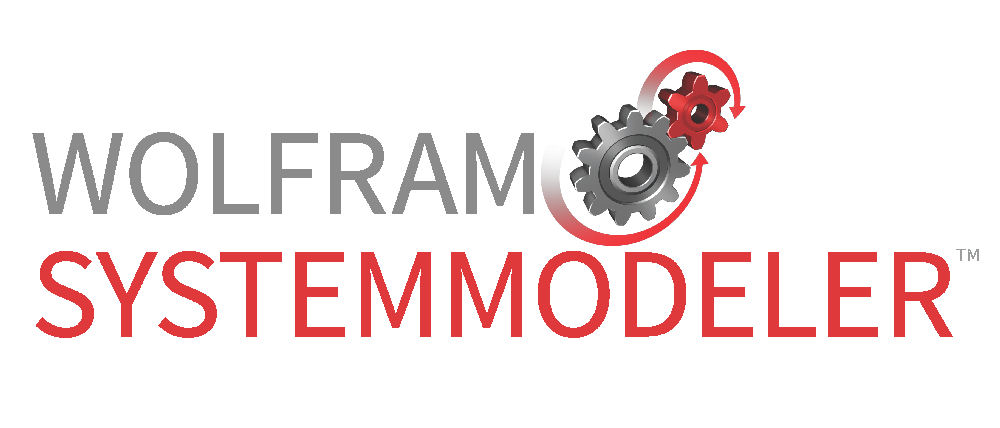</a>&nbsp;&nbsp; </td>
</tr>
</table>

<h2>Bronze Sponsors &amp; Exhibitors</h2>
<table>
<tr>
  <td> &nbsp;&nbsp;&nbsp;&nbsp; </td>
  <td> &nbsp;&nbsp;<a href="https://www.asim-gi.org/asim/">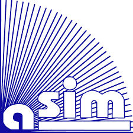</a>&nbsp;&nbsp; </td>
  <td> &nbsp;&nbsp;<a href="https://www.systemcontrolinnovationlab.de/">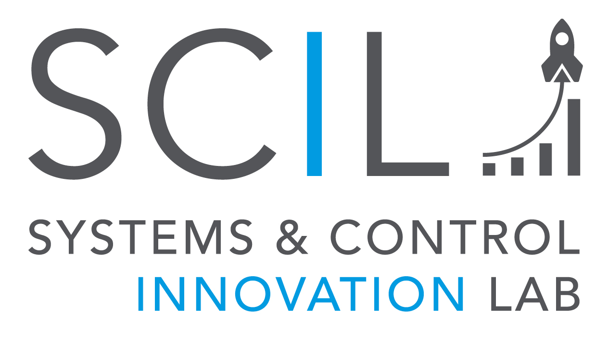</a>&nbsp;&nbsp; </td>
  <td> </td>
</tr>
<tr>
  <td> &nbsp;&nbsp;&nbsp;&nbsp; </td>
  <td> &nbsp;&nbsp;&nbsp;&nbsp; </td>
  <td> &nbsp;&nbsp;<a href="https://openmodelica.org/">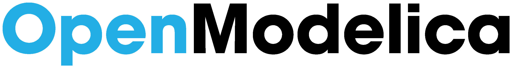</a>&nbsp;&nbsp; </td>
  <td> &nbsp;&nbsp;&nbsp;&nbsp; </td>
</tr>
</table>
